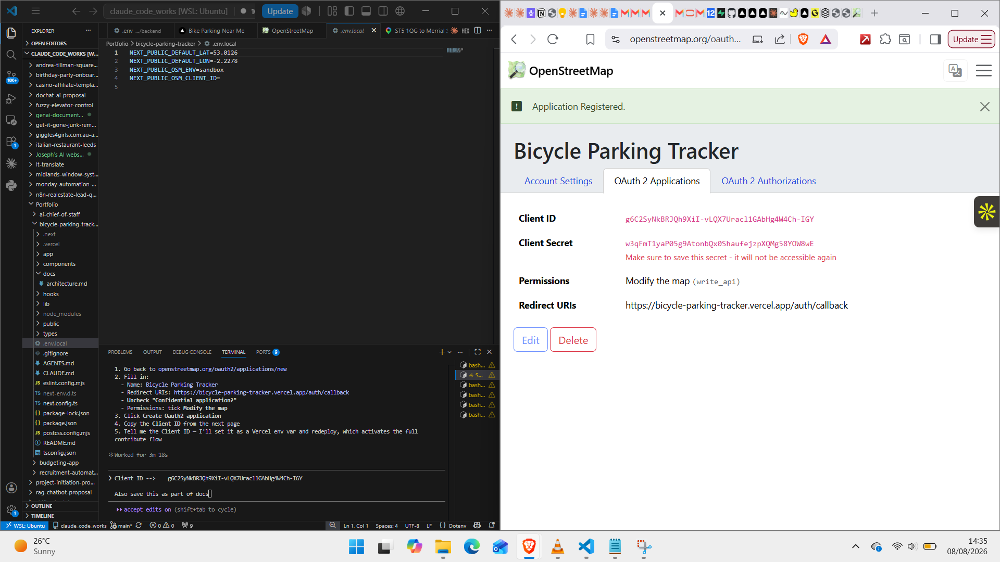

# Architecture — Bicycle Parking Tracker PWA

---

## Stage A Finding: Data Coverage

**Query:** `amenity=bicycle_parking` within 5km of Newcastle-under-Lyme (53.0126, -2.2278)

| Metric | Result |
|---|---|
| Total spots | **79** |
| Has capacity tag | 73 (92%) |
| Has covered tag | 73 (92%) |
| Has parking type | 71 (89%) |
| Has fee tag | 44 (55%) |

**Type breakdown:** stands (54), wall_loops (5), bollards (5), rack (2), shed (2), anchors (1), wide_stands (1), untagged (8)

**Freshness:** 77% of spots last edited in 2024–2026. Data is actively maintained.

**Verdict: Good to build.** 79 spots at 5km means ~10–20 spots in the default 750m radius around the town centre — useful day one. Fee coverage at 55% is the weakest field; the UI should show "unknown" gracefully rather than implying spots are always free. The 8 untagged-type spots are minor noise.

---

## 1. Overpass Query Design

### Base query

```
[out:json][timeout:25];
(
  node["amenity"="bicycle_parking"](around:{radius},{lat},{lon});
  way["amenity"="bicycle_parking"](around:{radius},{lat},{lon});
);
out body;
>;
out skel qt;
```

- Default radius: **750m**, user-adjustable to 250m / 500m / 1km / 2km
- `way` is included because some larger parking areas (sheds, sheltered zones) are mapped as closed polygons rather than points. The `>;out skel qt;` resolves way geometry into node coordinates.
- `out body` returns tags + coordinates + `timestamp` (last-edited date, shown in the UI as a data freshness signal)

### Tag mapping

| OSM tag | App field | Notes |
|---|---|---|
| `capacity` | Capacity | Integer or "unknown" |
| `covered` | Covered | yes/no/unknown |
| `bicycle_parking` | Type | stands, rack, shed, bollard, wall_loops, etc. |
| `fee` | Fee | yes/no/unknown |
| `timestamp` | Last updated | Shown as relative date ("updated 3 months ago") |
| `name` | Name | Optional — most spots don't have one |
| `access` | Access | public/private/customers — shown if present |

### Fallback mirror list

Tried in order; move to next on timeout or HTTP error:

```ts
const OVERPASS_MIRRORS = [
  "https://overpass-api.de/api/interpreter",
  "https://lz4.overpass-api.de/api/interpreter",
  "https://z.overpass-api.de/api/interpreter",
  "https://overpass.kumi.systems/api/interpreter",
];
```

On all mirrors failing: return cached results if available; show "Using offline data" banner.

---

## 2. Caching Strategy

### Client-side cache (IndexedDB)

Every successful Overpass response is stored in IndexedDB under a cache key derived from the query area. On next open, if the cached area covers the current location and is fresh enough, the cached data is shown immediately while an optional background refresh runs.

```ts
interface CachedArea {
  centerLat: number;
  centerLon: number;
  radiusMetres: number;
  fetchedAt: number;       // Unix ms
  spots: BicycleSpot[];
}

// Cache key: "52.9800,-2.2278,750" (rounded to 2dp, radius)
```

**TTL logic:**
- < 1 hour old: use cache, no background refresh (Overpass fair use)
- 1–24 hours old: show cache immediately, background-refresh silently
- > 24 hours old: show cache with "data may be outdated" banner, refresh required

**Offline use:** If all Overpass mirrors fail and a cache entry exists for the area, serve the cache with a prominent "Offline — showing last known data" banner. The spots are still useful for navigation even if a day old.

**Cache coverage check:** A cached area covers the current query if the distance between the cached centre and current location is less than `cachedRadius * 0.5`. Outside that bound, treat as a new query.

### No backend proxy — rationale

With one user making occasional queries (personal use scale), client-side caching is sufficient to respect Overpass fair use. The TTL logic above means the API is hit at most once per hour per area, even with repeated app opens. A backend proxy would add deployment complexity (Render cold starts, another service to maintain) with no benefit at this scale.

**If this became a product** (many concurrent users in the same area), a proxy that de-duplicates requests and serves a shared cache would matter. For now: no proxy, direct Overpass calls, client-side TTL.

---

## 3. OSM Contribute-Back Flow

### OAuth 2.0 setup

OSM supports OAuth 2.0 with PKCE — no backend secret required. The entire OAuth flow runs client-side.

**App registration:** Registered at `openstreetmap.org/oauth2/applications/new`



| Field | Value |
|---|---|
| App name | Bicycle Parking Tracker |
| Client ID | `g6C2SyNkBRJQh9XiI-vLQX7Uracl1GAbHg4W4Ch-IGY` |
| Client Secret | `w3qFmTIyaP05g9AtonbQx0ShaufejzpXQMg58Y0W8vE` *(not used — PKCE public client)* |
| Redirect URI | `https://bicycle-parking-tracker.vercel.app/auth/callback` |
| Scope | `write_api` only |
| Type | Public client (PKCE — no client secret needed in-app) |

**Flow:**
```
User taps "Add parking spot"
  → redirect to accounts.openstreetmap.org/oauth2/authorize
  → user logs in + grants write_api permission
  → redirect back to /auth/callback?code=...
  → exchange code for access_token (PKCE, no secret)
  → store token in sessionStorage (not localStorage — cleared on tab close)
```

### Submission flow (changeset → node → close)

Three sequential API calls to create one spot:

```
1. PUT /api/0.6/changeset/create
   Body: <osm><changeset><tag k="created_by" v="BicycleParkingTracker/1.0"/>
               <tag k="comment" v="Add bicycle parking"/></changeset></osm>
   → returns changeset_id

2. PUT /api/0.6/node/create
   Body: <osm><node changeset="{changeset_id}" lat="{lat}" lon="{lon}">
     <tag k="amenity" v="bicycle_parking"/>
     <tag k="capacity" v="{capacity}"/>          (only if filled in)
     <tag k="covered" v="{covered}"/>            (only if filled in)
     <tag k="bicycle_parking" v="{type}"/>       (only if filled in)
   </node></osm>
   → returns node_id

3. PUT /api/0.6/changeset/{changeset_id}/close
```

### Sandbox vs production

| Environment | Base URL | When to use |
|---|---|---|
| Sandbox | `master.apis.dev.openstreetmap.org` | All development and testing |
| Production | `api.openstreetmap.org` | After sandbox is confirmed working end-to-end |

The app reads `NEXT_PUBLIC_OSM_ENV=sandbox|production` from env. Default is `sandbox`. Switching to production is a deliberate manual step (change the env var and redeploy), not something that happens automatically.

A visible banner in the contribute flow always shows which environment is active: **"SANDBOX — edits go to test server, not the real map"** / **"LIVE — edits will appear on openstreetmap.org"**

### Review screen (the approval gate)

Before any API call is made, the user sees an explicit review screen showing exactly what will be submitted:

```
┌─────────────────────────────────────┐
│  Review your submission             │
│                                     │
│  📍 Location  53.0126, -2.2278      │
│  🚲 Type      Stands                │
│  📦 Capacity  12                    │
│  🏠 Covered   Yes                   │
│                                     │
│  This will add a new point to       │
│  OpenStreetMap. Once submitted,     │
│  it is visible to everyone.         │
│                                     │
│  [Edit]          [Submit to OSM]    │
└─────────────────────────────────────┘
```

"Submit to OSM" is the only button that triggers the API calls. There is no automatic submission.

---

## 4. PWA Setup

```
next-pwa (via @ducanh2912/next-pwa or serwist)
manifest.json — name, icons, theme_color, display: standalone
```

**What gets cached by the service worker:**
- App shell (HTML, JS, CSS, icons) — cache-first, update in background
- Leaflet tiles — cache-first with 7-day TTL (tiles don't change often)
- Overpass responses — NOT cached by service worker (handled by IndexedDB logic above, which is more flexible)

**Install prompt:** Standard PWA `beforeinstallprompt` — surfaced as a subtle "Add to home screen" banner after the user has used the app once, not on first open.

---

## 5. Project Structure

```
bicycle-parking-tracker/
├── app/
│   ├── page.tsx              # Map + list view (default: map)
│   ├── spot/[id]/page.tsx    # Spot detail + directions deep link
│   ├── contribute/page.tsx   # Contribute flow (OAuth → form → review → submit)
│   ├── auth/callback/page.tsx # OSM OAuth callback handler
│   └── layout.tsx
├── components/
│   ├── MapView.tsx           # Leaflet map with spot markers
│   ├── ListView.tsx          # Distance-sorted list
│   ├── SpotCard.tsx          # Shared card component
│   ├── RadiusSlider.tsx      # Adjustable search radius
│   └── ContributeForm.tsx    # Capacity/covered/type form
├── lib/
│   ├── overpass.ts           # Query builder + mirror fallback
│   ├── cache.ts              # IndexedDB read/write
│   ├── geo.ts                # Haversine distance, bearing
│   ├── osm-auth.ts           # OAuth PKCE flow
│   └── osm-api.ts            # Changeset + node submission
├── types/
│   └── spot.ts               # BicycleSpot interface
├── public/
│   ├── manifest.json
│   └── icons/
└── docs/
    └── architecture.md
```

---

## 6. Environment Variables

```bash
NEXT_PUBLIC_OSM_ENV=sandbox          # 'sandbox' | 'production'
NEXT_PUBLIC_OSM_CLIENT_ID=           # from openstreetmap.org OAuth app registration
NEXT_PUBLIC_DEFAULT_LAT=53.0126      # default map centre (Newcastle-under-Lyme)
NEXT_PUBLIC_DEFAULT_LON=-2.2278
```

No secrets. All values are `NEXT_PUBLIC_` — this app has no backend.

---

*Stage A complete. Ready for Stage B: geolocation capture, Overpass query pipeline, distance sorting.*
